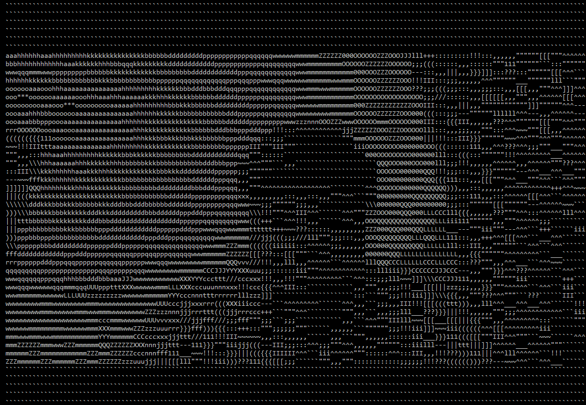
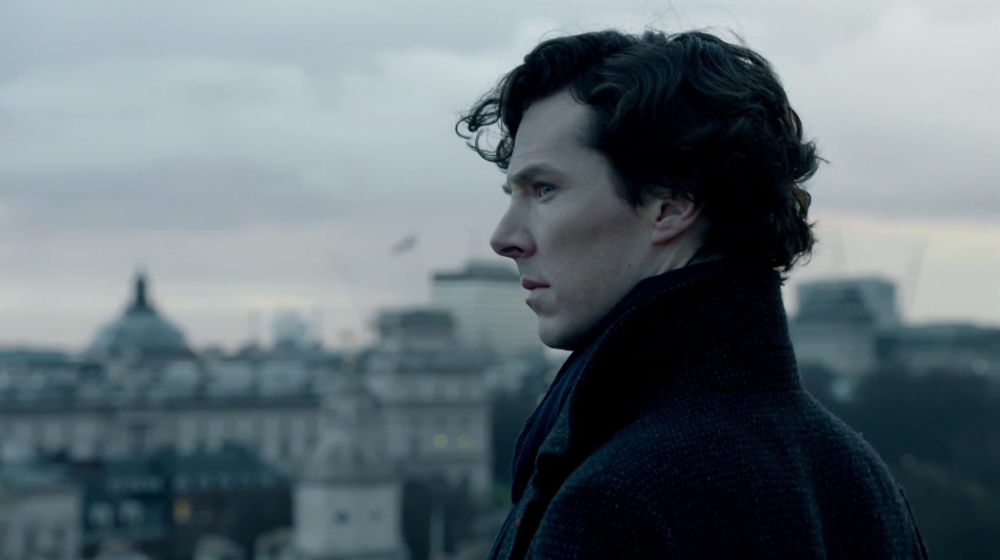
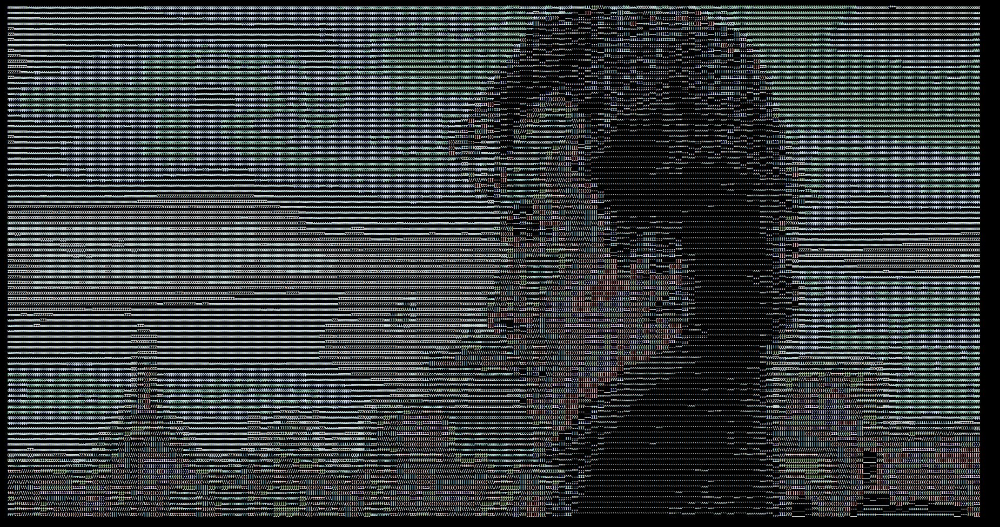
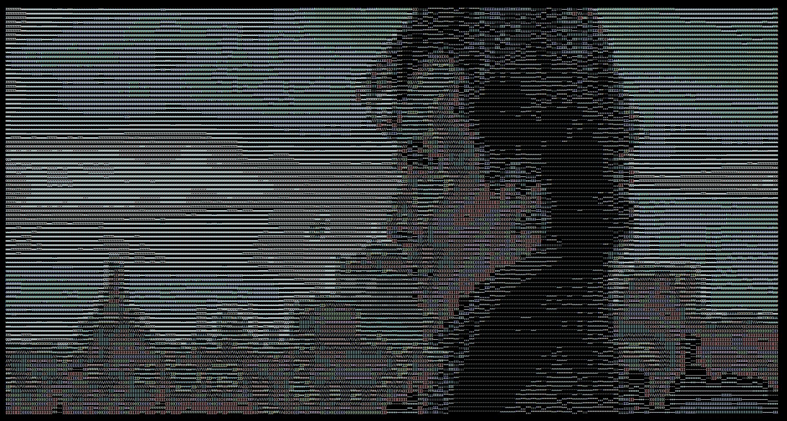
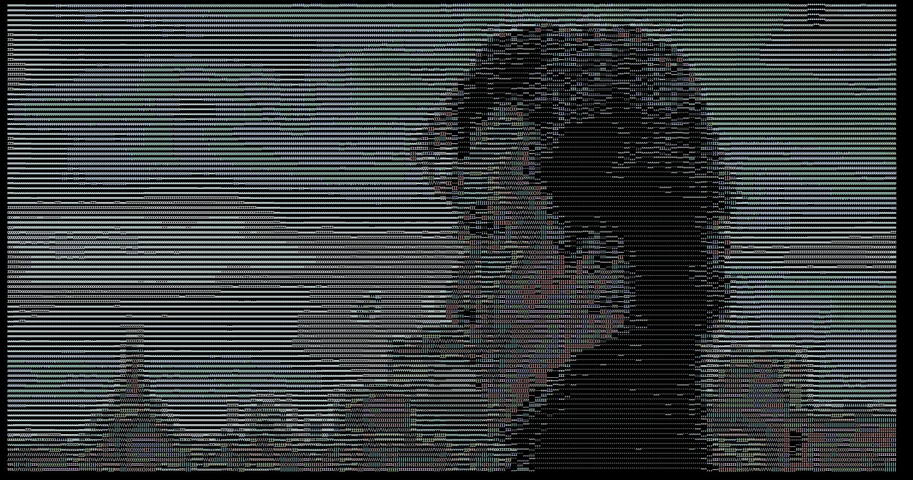

# Ascii art

Simple, but amazing to play with.

Sample WebCam feed as seen by ascii-art lens

### Input image

### Output image
##### Algorithm used for brightness - Average
brightness = (R + G + B) / 3

##### Algorithm used for brightness - Min Max
brightness = (Max(R, G, B) + Min(R, G, B)) / 2

##### Algorithm used for brightness - Luminosity
brightness = 0.21 * R + 0.72 * G + 0.07 * B

